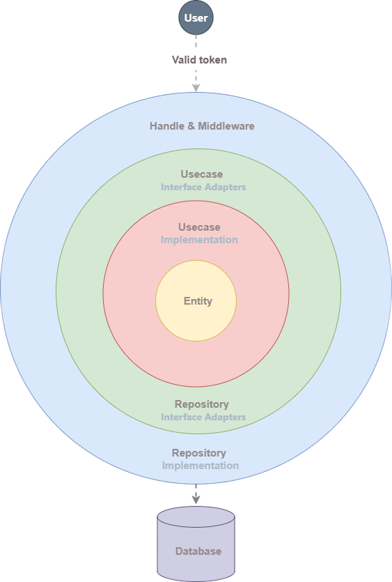

[Tiếng Việt](./README.vi.md) | [English](./README.md)

<div align="center">


### Backend Golang Nhanh & Mở Rộng

<p>
  REST API được xây dựng với <b>Go</b>, thiết kế để đạt hiệu suất cao,
  kiến trúc clean architecture và phát triển backend hiện đại.
</p>

<p>
  
  
  
  
  
</p>

</div>

---

## Mục Lục

- [Tính Năng](#tính-năng)
- [Bắt Đầu Nhanh](#bắt-đầu-nhanh)
- [Cấu Hình](#cấu-hình)
- [Cơ Sở Dữ Liệu & Redis](#cơ-sở-dữ-liệu--redis)
- [Migration](#migration)
- [Chạy Ứng Dụng](#chạy-ứng-dụng)
- [Cấu Trúc Dự Án](#cấu-trúc-dự-án)
- [Clean Architecture](#clean-architecture)
- [Công Nghệ Sử Dụng](#công-nghệ-sử-dụng)
- [Các Thực Hành Tốt Nhất](#các-thực-hành-tốt-nhất)
- [Giấy Phép](#giấy-phép)

---

## Tính Năng

| Tính Năng | Mô Tả |
|-----------|-------|
| **Xác Thực JWT** | Xác thực an toàn dựa trên token với Refresh Token|
| **Tự Động Tạo Swagger** | Tài liệu API được tạo tự động |
| **Migration Cơ Sở Dữ Liệu** | Kiểm soát phiên bản cho schema cơ sở dữ liệu |
| **Tiện Ích Băm** | Băm mật khẩu an toàn |
| **Che Giấu UID** | Ẩn ID người dùng nhạy cảm |
| **Clean Architecture** | Cấu trúc mã nguồn có thể mở rộng và bảo trì |
| **Hỗ Trợ Redis** | Tích hợp sẵn bộ nhớ đệm |
| **Giới Hạn Tốc Độ** | Bảo vệ API của bạn |
| **Hỗ Trợ GORM** | ORM mạnh mẽ cho các thao tác cơ sở dữ liệu |

---

## Bắt Đầu Nhanh

### 1. Cài Đặt

```bash
# Cài đặt CLI Witches
go install github.com/DVV-15324/witches@latest

# Kiểm tra cài đặt
witches version
```

### 2. Tạo Dự Án Mới

```bash
# Tạo dự án mới
witches create example

# Di chuyển vào thư mục dự án
cd example
```

#### Đã Tạo: `witches.env`

```env
# CẤU HÌNH MÁY CHỦ

APP_PORT=8080


# CẤU HÌNH CƠ SỞ DỮ LIỆU

DB_DRIVER=%s
DB_USER=root
DB_HOST=localhost
DB_PORT=3306
DB_NAME=your_database
DB_PASSWORD=your_password


# CẤU HÌNH REDIS

REDIS_HOST=localhost
REDIS_PORT=6379
REDIS_PASSWORD=


# THỜI GIAN HẾT HẠN TOKEN

ACCESS_TOKEN_TTL=900
REFRESH_TOKEN_TTL=604800


# CÀI ĐẶT PHIÊN

SESSION_TTL=604800
IDLE_TIMEOUT=1800


# CÀI ĐẶT DANH SÁCH ĐEN

REVOKED_TTL=300


# GIỚI HẠN TỐC ĐỘ

RATE_LIMIT_PERIOD=60
RATE_LIMIT_MAX=100 
```

---

## Cấu Hình

### Tham Chiếu Biến Môi Trường

| Biến | Loại | Mô Tả |
|----------|------|-------------|
| `APP_PORT` | string | Cổng máy chủ ứng dụng |
| `APP_ADDRESS` | string | Địa chỉ máy chủ ứng dụng |
| `DB_DRIVER` | string | Trình điều khiển cơ sở dữ liệu (mysql, postgres, mssql) |
| `DB_HOST` | string | Máy chủ cơ sở dữ liệu |
| `DB_PORT` | string | Cổng máy chủ cơ sở dữ liệu |
| `DB_PASSWORD` | string | Mật khẩu cơ sở dữ liệu |
| `DB_NAME` | string | Tên cơ sở dữ liệu |
| `REDIS_HOST` | string | Máy chủ Redis |
| `REDIS_PORT` | string | Cổng máy chủ Redis |
| `REDIS_PASSWORD` | string | Mật khẩu Redis |
| `ACCESS_TOKEN_TTL` | int64 | Thời gian hết hạn access token (giây) |
| `REFRESH_TOKEN_TTL` | int64 | Thời gian hết hạn refresh token (giây) |
| `SESSION_TTL` | int64 | Thời gian hết hạn phiên (giây) |
| `REVOKED_TTL` | int64 | Thời gian tồn tại cache token bị thu hồi (giây) |
| `IDLE_TIMEOUT` | int64 | Thời gian chờ HTTP không hoạt động (giây) |
| `RATE_LIMIT_PERIOD` | int64 | Cửa sổ thời gian giới hạn tốc độ (giây) |
| `RATE_LIMIT_MAX` | int64 | Số yêu cầu tối đa mỗi khoảng thời gian |

### Chỉnh Sửa Cấu Hình

Chỉnh sửa `witches.env` với cài đặt thực tế của bạn:

```env
# CẤU HÌNH MÁY CHỦ

APP_PORT=8080


# CẤU HÌNH CƠ SỞ DỮ LIỆU

DB_DRIVER=mysql
DB_USER=root
DB_HOST=localhost
DB_PORT=3307
DB_NAME=test
DB_PASSWORD=123


# CẤU HÌNH REDIS

REDIS_HOST=localhost
REDIS_PORT=6379
REDIS_PASSWORD=


# THỜI GIAN HẾT HẠN TOKEN

ACCESS_TOKEN_TTL=900
REFRESH_TOKEN_TTL=604800


# CÀI ĐẶT PHIÊN

SESSION_TTL=604800
IDLE_TIMEOUT=1800


# CÀI ĐẶT DANH SÁCH ĐEN

REVOKED_TTL=300


# GIỚI HẠN TỐC ĐỘ

RATE_LIMIT_PERIOD=60
RATE_LIMIT_MAX=100 
```
---

## Cơ Sở Dữ Liệu & Redis

### Sử Dụng Cơ Sở Dữ Liệu Hiện Có Của Bạn

> **Hỗ trợ:** MySQL, PostgreSQL, MSSQL

```bash
witches database up
```

Lệnh này sẽ:
- Tự động tạo `DB_URL` cho MySQL và PostgreSQL
- Nhắc bạn cấu hình thủ công `DB_URL` cho MSSQL

#### Ví dụ Đầu Ra:

```text
# CẤU HÌNH CƠ SỞ DỮ LIỆU
DB_DRIVER=mysql
DB_HOST=localhost
DB_PORT=3306
DB_NAME=test
DB_PASSWORD=123
DB_URL=root:123@tcp(localhost:3307)/test?charset=utf8mb4&parseTime=True&loc=Local

# CẤU HÌNH REDIS
REDIS_HOST=localhost
REDIS_PORT=6379
REDIS_PASSWORD=
```

---

## Migration

### 1. Khởi Tạo & Cài Đặt Dependencies

```bash
# Tạo các mẫu
witches init

# Cài đặt dependencies
witches install
```

### 2. Các File Migration

**Up Migration** (`./migrate/migrations/1_init.up.sql`):
**Down Migration** (`./migrate/migrations/1_init.down.sql`):

# Cài đặt dependencies

```bash
witches migrate up
```

### 3. Các Lệnh Migration

| Lệnh | Mô Tả |
|---------|-------------|
| `witches migrate up` | Áp dụng 1 migration đang chờ |
| `witches migrate down` | Hoàn tác 1 migration |
| `witches migrate version` | Hiển thị phiên bản migration hiện tại |
| `witches migrate force <version>` | Buộc đặt phiên bản migration |
| `witches migrate drop` | Xóa tất cả bảng ⚠️ NGUY HIỂM |

> **Lưu ý:** Các lệnh migration yêu cầu Docker được cài đặt và đang chạy.

---

## Chạy Ứng Dụng

```bash
# Khởi động ứng dụng
witches run

# Máy chủ đang chạy tại: http://localhost:8080
```

---

## Cấu Trúc Dự Án

```
.
├── cmd/
│   └── server/              # Điểm vào ứng dụng
│       ├── config/          # Tải cấu hình
│       └── routers/         # Định nghĩa route
├── internal/
│   ├── dto/                 # Đối tượng truyền dữ liệu
│   │   ├── auth/
│   │   │   ├── request/
│   │   │   └── response/
│   │   └── user/
│   │       ├── request/
│   │       └── response/
│   ├── entity/              # Thực thể nghiệp vụ
│   │   ├── auth/
│   │   └── user/
│   ├── handler/             # Trình xử lý HTTP
│   │   ├── auth/
│   │   └── user/
│   ├── mapping/             # Ánh xạ DTO ↔ Entity
│   ├── middleware/          # Middleware HTTP
│   ├── repository/          # Tầng truy cập dữ liệu
│   │   ├── auth/
│   │   └── user/
│   ├── usecase/             # Logic nghiệp vụ
│   │   ├── auth/
│   │   └── user/
│   └── utils/               # Hàm tiện ích
├── logs/                    # Log của ứng dụng
├── migrate/                 # Migration cơ sở dữ liệu
│   └── migrations/
├───pkg
│   └───redis                # Redis client
└── swagger/                 # Tài liệu Swagger

```

---

## Clean Architecture

Dự án này tuân theo **Clean Architecture** của Robert C. Martin (Uncle Bob).

### Ánh Xạ Tầng

| Thư Mục | Tầng | Trách Nhiệm |
|-----------|-------|----------------|
| `internal/entity/` | **Entities** | Quy tắc nghiệp vụ cốt lõi, độc lập với framework |
| `internal/usecase/` | **Use Cases** | Quy tắc nghiệp vụ cụ thể của ứng dụng |
| `internal/handler/`<br>`internal/dto/` | **Interface Adapters** | Chuyển đổi dữ liệu giữa tầng bên ngoài và bên trong |
| `internal/repository/` | **Interface Adapters** | Thao tác cơ sở dữ liệu, lưu trữ dữ liệu |
| `internal/middleware/` | **Frameworks & Drivers** | Các thành phần phụ thuộc vào framework |
| `cmd/server/` | **Frameworks & Drivers** | Điểm vào ứng dụng, tiêm phụ thuộc |
| `pkg/` | **Frameworks & Drivers** | Tiện ích dùng chung (DB, Redis, logging) |

<div align="center">
  
</div>

---

## Công Nghệ Sử Dụng

| Thành Phần | Công Nghệ |
|-----------|------------|
| **HTTP Framework** | [Gin](https://github.com/gin-gonic/gin) |
| **ORM** | [GORM](https://gorm.io/) |
| **Logger** | [Zap](https://github.com/uber-go/zap) |
| **Migration** | [Golang-Migrate](https://github.com/golang-migrate/migrate) |
| **Cache** | [Redis](https://redis.io/) |
| **Swagger** | [EasyJSON](https://github.com/mailru/easyjson) |
| **CLI** | [Cobra](https://github.com/spf13/cobra) |
| **Database** | PostgreSQL / MySQL / MSSQL |
...

Cảm ơn tất cả các nhà đóng góp mã nguồn mở đã tạo nên những công cụ tuyệt vời này ❤️
---

## Các Thực Hành Tốt Nhất

- Luôn viết cả migration `up` và `down`
- Kiểm thử migration trong môi trường phát triển trước khi lên production
- Không bao giờ chỉnh sửa migration đã được áp dụng - hãy tạo migration mới
- Sao lưu cơ sở dữ liệu trước khi chạy migration trên production
- Giữ cho migration độc lập với mã nguồn ứng dụng
- Sử dụng biến môi trường cho cấu hình

---

## Giấy Phép

Giấy phép MIT

---

## Hỗ Trợ

- Mở một [issue](https://github.com/DVV-15324/witches/issues)

---

<div align="center">
  <br>
  <div><b> Mã Nguồn Mở · Phi Lợi Nhuận</b></div>
  Dự án này hoàn toàn là mã nguồn mở và phi lợi nhuận.<br>
  Được xây dựng với đam mê cho cộng đồng Go.
  Được tạo bởi <a href="https://github.com/DVV-15324">DVV-15324</a>
  <br><br>
</div>
